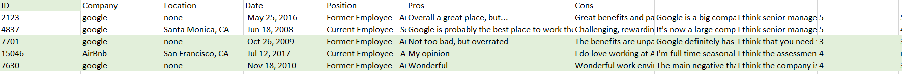

# JBolt Search,Classifier,Recommendation System
 ## Web Application
 ***https://dmsearch.herokuapp.com/***
 
# Search:
**Jbolt Search Engine** is web application that currently has search engine feature based on TF-IDF algorithm where user is able to enter the contributes they would like there future company to have and the result will show the company with related attributes or environment.
**Dataset** has 17 fields where company and pros are the most important attribute for this search engine.

***Code (Search Engine):***
Removing the stop words from the data and converting all multiple white-space characters to single whitespace

                 
      stop_words = stopwords.words('english')
      feature = str(feature)
      feature = re.sub('[^a-zA-Z\s]', '', feature)
      feature = [w for w in feature.split() if w not in set(stop_words)]
      return ' '.join(feature)
 Stemming the words altogether so that similar meaning words are not treated as separate words
 
      english_stemmer = SnowballStemmer('english')
      analyzer = CountVectorizer().build_analyzer()
    
 TF-IDF Calculation for the User's Query
 
       query_matrix = count.transform([query])
       query_tfidf = tfidf_transformer.transform(query_matrix)
       
 Cosine Similarity Scores to retrieve the top similar results'
 
       sim_score = cosine_similarity(query_tfidf, train_tfidf)
 
# Classification

Classification separates observations into groups based on their characteristics. For exampls, students applying to engineering schools could be separated into potential acceptance, maybe accepted, and unlikely expected based on grades, GRE scores, industrial experience, and outstanding activities.
 
**Algorithm Used**
***Multinomial Naive Bayes Classification:***
Naive Bayes is a machine learning algorithm for classification problems. It is basically based on Bayes probability theorem. this algorithm is one of the simplier algorithm and fast to build models and it makes predictions with Naive Bayes algorithm.

****Bayes’ Theorem is stated as:****

***P(h|d) = (P(d|h) * P(h)) / P(d)***

***f1,f2,f3,....fn = fields in the dataset***
****This application classifies company based on the values from the following field****
- Work-life balance
- Ranking
- Cultural ratings
- Growth Opportunities ratings
- Benefits rating
- Senior Management

***Code (Search Engine):***
The function below counts the number of times a company occur in the dataset where name is the variable which is the name of the company for example : Google, Facebook, Netflix, Amazon

     def count(name):
        n_count = data['Company'][data['Company'] == name].count()
        return n_count

The function below takes the company name count by calling the count function then divide the count by the total number of rows in the dataset to get the Probability count of the company name
    def P_count(name):
        P_company = count(name) / n_rows
        return P_company

Following are the two main steps in the Naive Bayes Algorithm
****Calculating mean*****

    mean = data_means[col][data_var.index == name].values[0]
****Calculating variance****
 
     variance = data_var[col][data_var.index == name].values[0]
****Calculating Likelihood****
 P(X|Y): Probability of X given Y:
 
       p = 1 / (np.sqrt(2 * np.pi * vy)) * np.exp((-(x - my)**2) / (2 * vy))
       
****Formula for the Algorithm****:

where name is the variable which represents the name of the company

        result = P_count(name) * \
            Px_given_Py(c0, calc_mean('Workload', name), calc_var('Rating', name)) * \
            Px_given_Py(c1, calc_mean('Workload', name), calc_var('Workload', name)) * \
            Px_given_Py(c2, calc_mean('Culture', name), calc_var('Culture', name)) * \
            Px_given_Py(c3, calc_mean('Growth', name), calc_var('Growth', name)) * \
            Px_given_Py(c4, calc_mean('Benefits', name), calc_var('Benefits', name)) * \
            Px_given_Py(c5, calc_mean('Management', name), calc_var('Management', name))
            

 ## Deployment:
**Web Application Link** https://dmsearch.herokuapp.com/
The application is hosted on free hosting site heroku, the deployment is straight forward deploying the site from the github repository but you might get some errors which I encounter when uploading the website on the heroku server.

1. The packages I include were not available directly to Heroku server therefore I had to create a requirement.txt file on the root directory of the project first using pip which will save all the packages required to successfully run the app on the server.

Use the command below to download pip first if you don't have pip already install

      $curl https://bootstrap.pypa.io/get-pip.py -o get-pip.py
      $python get-pip.py
Then go to your project folder and then paste the following command to get your requirement.txt
                                  
       $pip freeze > requirements.txt
                                  
After uploading the web also check if you web dyno is set or not if not you need to manually set it I used the following
                                  
       web gunicorn django_classify.wsgi
       
       
 ## References
- https://medium.freecodecamp.org/how-to-process-textual-data-using-tf-idf-in-python-cd2bbc0a94a3
- https://towardsdatascience.com/tfidf-for-piece-of-text-in-python-43feccaa74f8
- https://github.com/Heetmadhu/Movie-Recommendation/blob/master/MovieSearch.ipynb
- https://scikit-learn.org/stable/modules/generated/sklearn.feature_extraction.text.TfidfVectorizer.html
- https://github.com/mohdkashif93/tf-idf-implementation
- https://www.kaggle.com/rakeshrau/social-network-ads
- https://www.kaggle.com/ash316/ml-from-scratch-part-2
- https://towardsdatascience.com/na%C3%AFve-bayes-from-scratch-using-python-only-no-fancy-frameworks-a1904b37222d
- https://chrisalbon.com/machine_learning/naive_bayes/naive_bayes_classifier_from_scratch/

